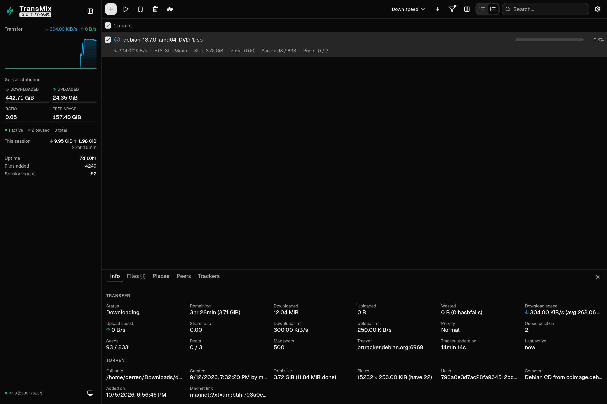

# TransMix

A modern, drop-in replacement for the Transmission BitTorrent web UI. Dark & light themes, live transfer graph, rich torrent details, and a mobile-ready layout — no backend of its own, it talks straight to Transmission's `/transmission/rpc`.



## Highlights

- **Drop-in replacement** for `transmission-web` via `TRANSMISSION_WEB_HOME` — same origin RPC, no config, no CORS
- **Torrent list** in compact or rich view: sortable columns, search, status/label/tracker/path filters, column customization, drag-to-resize details panel
- **Details panel**: Info, Files (per-file priorities), Peers, Trackers, and a virtualized **piece map** with skipped-piece markers and hover progress ring
- **Speed graph** with live ↓/↑ rates; global speeds also shown in the **tab title** (`↓ 120 KiB/s ↑ 80 KiB/s - TransMix`)
- **Dialogs**: add torrent, move data, session settings, per-torrent settings, labels, remove-with-delete-data confirmation
- **Sidebar**: server statistics, free space, this-session totals, uptime
- Dark & light themes (follows system, persisted), uniform toolbars with tooltips, context menus
- Mobile-ready responsive layout

## Deployment

Build a static bundle and point Transmission at it:

```bash
npm install
npm run build            # → dist/
mkdir -p /path/to/transmission-web-home
tar -xzf transmix-v0.0.2.tar.gz -C /path/to/transmission-web-home/   # or copy dist/* there
# (.zip with the same contents is also attached to each GitHub Release)
```

Run Transmission with the custom UI directory:

```bash
TRANSMISSION_WEB_HOME=/path/to/transmission-web-home transmission-daemon
```

Then open `http://server:9091/` (it redirects to `/transmission/web/`, where the UI is served).

Notes:

- Prebuilt bundles (`.tar.gz` + `.zip`) are attached to [GitHub Releases](https://github.com/id0o0bi/transmix/releases).
- The build targets the canonical base path `/transmission/web/`; RPC is called via the relative URL `../rpc`, so it works on any host, over http or https, and behind reverse proxies that keep Transmission's path layout.

## Development

```bash
npm install
npm run dev        # dev server at http://localhost:5173/transmission/web/
```

The dev server proxies `/transmission/rpc` to `VITE_RPC_PROXY_TARGET` (default `http://127.0.0.1:9091`).

```bash
npm run build      # production bundle → dist/
npm run preview    # serve dist/ at http://localhost:5174/transmission/web/
npm test           # vitest
npm run lint       # oxlint
npx tsc -b         # typecheck
```

## Tech stack

Vite · React 19 · TypeScript (strict) · Tailwind CSS v4 · shadcn/ui on Radix · TanStack Query & Virtual · lucide-react · vitest

## Compatibility

Built and tested against Transmission **4.1.3** (RPC v19). Should work with Transmission 3.x/4.x — the UI only uses stable session/torrent RPC methods.
